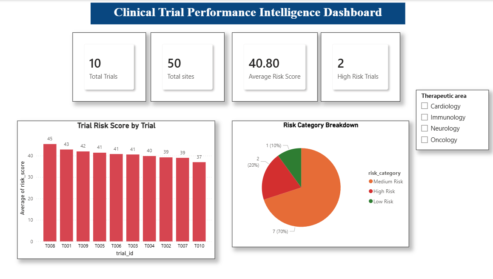
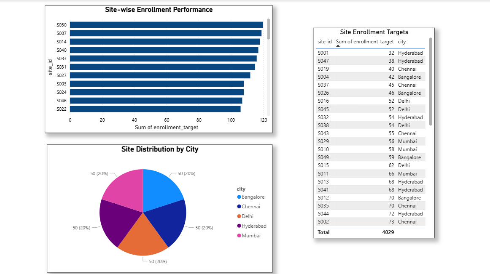
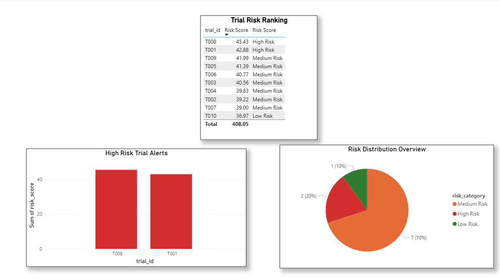
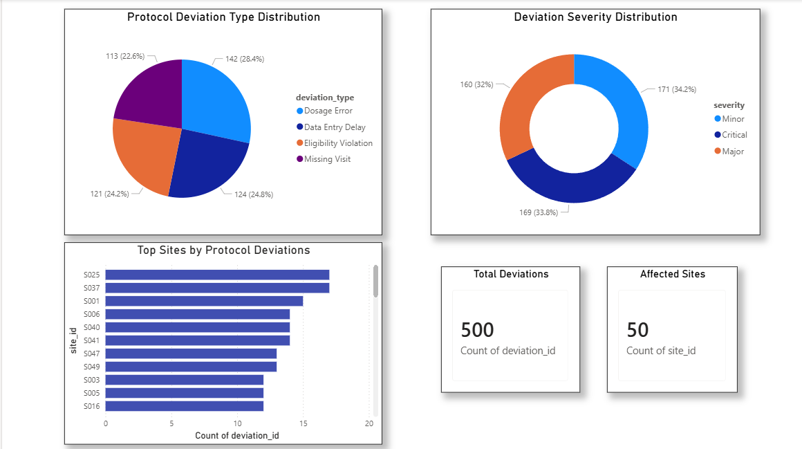

# Clinical Trial Performance Intelligence System
## Dashboard Preview








## Project Overview

Clinical trials generate large volumes of operational data across multiple study sites. Delays in enrollment, protocol deviations, patient dropout, and site performance issues can significantly impact trial timelines and costs.

This project simulates a multi-site clinical trial environment and provides an end-to-end analytics solution using SQL, Python, SQLite, and Power BI. The system analyzes clinical trial performance, identifies operational bottlenecks, and generates risk scores to highlight trials that may be at risk of delayed completion.

---

## Business Problem

Clinical trial sponsors and research organizations need visibility into:

* Site-wise enrollment performance
* Patient dropout trends
* Protocol deviation frequency
* Trial risk indicators
* Operational performance across study sites

This project addresses these challenges by combining data engineering, analytics, and visualization into a unified intelligence platform.

---

## Tools & Technologies

| Tool     | Purpose                            |
| -------- | ---------------------------------- |
| SQL      | Data extraction and analysis       |
| Python   | Data generation and risk scoring   |
| SQLite   | Database management                |
| Power BI | Interactive dashboard development  |
| Pandas   | Data processing and transformation |

---

## Dataset Structure

The project uses synthetic clinical trial data consisting of:

### trials.csv

Contains trial-level information:

* Trial ID
* Trial Phase
* Therapeutic Area
* Target Enrollment
* Planned Duration

### sites.csv

Contains site-level information:

* Site ID
* Trial ID
* City
* Principal Investigator
* Enrollment Target

### patient_events.csv

Contains patient activity data:

* Patient ID
* Trial ID
* Site ID
* Enrollment Date
* Status
* Dropout Reason
* Adverse Event Indicator

### protocol_deviations.csv

Contains protocol compliance information:

* Deviation ID
* Trial ID
* Site ID
* Deviation Type
* Severity Level

---

## Project Architecture

```text
Synthetic Clinical Trial Data
            │
            ▼
         SQLite
            │
            ▼
      SQL Analysis
            │
            ▼
    Python Risk Scoring
            │
            ▼
     Power BI Dashboard
```

---

## SQL Analytics Performed

### Site Enrollment Performance

Analyzed patient enrollment volumes across study sites to identify high-performing and low-performing locations.

### Patient Dropout Analysis

Calculated dropout rates at the trial level to identify retention challenges.

### Protocol Deviation Monitoring

Measured deviation frequency across sites to identify compliance risks.

### Adverse Event Analysis

Tracked adverse event occurrence across patient populations.

---

## Risk Scoring Methodology

A composite risk score was developed to identify trials with higher operational risk.

### Formula

Risk Score =

0.4 × Dropout Rate

* 0.3 × Protocol Deviation Score

* 0.3 × Enrollment Delay Score

### Risk Categories

| Score Range | Category    |
| ----------- | ----------- |
| ≤ 38        | Low Risk    |
| 39–42       | Medium Risk |
| > 42        | High Risk   |

This scoring framework helps prioritize trials that may require additional monitoring or intervention.

---

## Dashboard Pages

### 1. Executive Overview

Features:

* Total Trials
* Total Sites
* Average Risk Score
* High-Risk Trial Count
* Trial Risk Distribution
* Risk Category Breakdown

### 2. Site Performance

Features:

* Site Enrollment Analysis
* City-wise Site Distribution
* Enrollment Target Monitoring

### 3. Risk Monitoring

Features:

* Trial Risk Ranking
* High-Risk Trial Alerts
* Risk Category Distribution

### 4. Protocol Deviation Analysis

Features:

* Deviation Type Distribution
* Severity Distribution
* Top Sites by Protocol Deviations

---

## Key Findings

* Certain trials exhibited significantly higher operational risk scores.
* Patient dropout rates were a major contributor to trial risk.
* Protocol deviations were concentrated within a subset of study sites.
* Enrollment delays directly impacted overall trial performance.
* Risk-based monitoring can help prioritize oversight efforts and resource allocation.

---

## Skills Demonstrated

* SQL Querying
* Relational Data Modeling
* Python Data Analysis
* Risk Scoring Framework Design
* Healthcare Analytics
* Clinical Trial Operations Analysis
* Dashboard Development
* Data Visualization
* Business Intelligence

---

## Repository Structure

```text
clinical-trial-intelligence/
│
├── data/
├── dashboard/
├── python/
├── sql/
├── screenshots/
├── README.md
└── clinical_trials.db
```

---

## Future Enhancements

* Real-world clinical trial datasets
* Automated risk monitoring workflows
* Advanced predictive modeling
* Site performance benchmarking
* Trial completion forecasting

---

## Author

Trilochana

MSc Medical Bioinformatics

Healthcare Analytics | Clinical Research | Data Analytics
